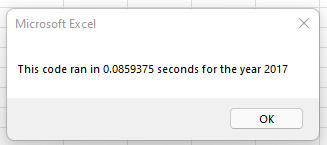
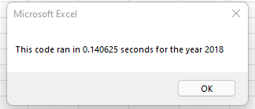

# Module 2 Challenge: Stock Analysis 

## Overview of Project
The purpose of this analysis is to compare the performance of a selection of Green Energy stocks across two years (2017 and 2018) on the basis of yearly return and total daily volume. 

This analysis is designed to be friendly to the end-user in the following ways: 
* The outputs include only the required information rather than any background calculations.
* The user has buttons that can clear the sheet and run the analysis.
* Input boxes allow the user to adjust the year for analysis. 
* Formatting is automatically applied to the worksheet to enhance readability, including conditional formatting to color-code positive vs negative yearly returns.
* The code has been refactored for efficiency as checked by run time calculations, so that the same code may be effectively applied to larger data sets. 


## Results
### Stock Performance Across Years
When looking at the output of the stock performance, we notice a stark difference between the results for 2017 as compared to 2018. While we do see a shift in the total daily volume, the most significant shift is in which stocks have a postive vs a negative yearly return. In the 2017 analysis, we see that all the stocks except one (TERP) have a **positive return**. Contrasntingly, in the 2018 analysis, all the stocks except two (RUN and ENPH) have a **negative return**. 

### Impact of Refactoring on Execution Times
### Code 
The main change I made in the process of refactoring the code was moving from nested for loops to using output arrays in order to handle the multiple outputs needed for the analysis. This allowed the code to be simplified into a single for loop.  Below is an excerpt from the macro, including the output arrays and excluding parts that were not changed in refactoring (i.e. headrer row, formatting).


```
'Activate data worksheet
    Worksheets(yearValue).Activate
    
    'Get the number of rows to loop over
    RowCount = Cells(Rows.Count, "A").End(xlUp).Row 'NTS: go back into module to understand line
    
    '1a) Create a ticker Index
    tickerIndex = 0

    '1b) Create three output arrays
    Dim tickerVolumes(12) As Long
    Dim tickerStartingPrices(12) As Single
    Dim tickerEndingPrices(12) As Single
    
    '2a) Create a for loop to initialize the tickerVolumes to zero.
    For i = 0 To 11
        tickerVolumes(i) = 0
        tickerStartingPrices(i) = 0
        tickerEndingPrices(i) = 0
    
    Next i
        
    '2b) Loop over all the rows in the spreadsheet.
    For i = 2 To RowCount
    
        '3a) Increase volume for current ticker
    tickerVolumes(tickerIndex) = tickerVolumes(tickerIndex) + Cells(i, 8).Value
        
        
        '3b) Check if the current row is the first row with the selected tickerIndex.
        If Cells(i - 1, 1).Value <> tickers(tickerIndex) And Cells(i, 1) = tickers(tickerIndex) Then
            'use column 6 because closing price of first instance is starting price
            tickerStartingPrices(tickerIndex) = Cells(i, 6).Value
            
        End If
        
        '3c) check if the current row is the last row with the selected ticker
         'If the next row’s ticker doesn’t match, increase the tickerIndex.
         If Cells(i + 1, 1).Value <> tickers(tickerIndex) And Cells(i, 1) = tickers(tickerIndex) Then
         
            tickerEndingPrices(tickerIndex) = Cells(i, 6).Value
            
        End If
        
        
            '3d Increase the tickerIndex.
        If Cells(i + 1, 1).Value <> tickers(tickerIndex) And Cells(i, 1) = tickers(tickerIndex) Then
            
            tickerIndex = tickerIndex + 1
            
        End If
    
    
    Next i
    
    
    '4) Loop through your arrays to output the Ticker, Total Daily Volume, and Return.
    For i = 0 To 11
        
        Worksheets("All Stocks Analysis").Activate
    
    Cells(4 + i, 1).Value = tickers(i)
    Cells(4 + i, 2).Value = tickerVolumes(i)
    Cells(4 + i, 3).Value = tickerEndingPrices(i) / tickerStartingPrices(i) - 1
   
        
    Next i
    
```


### Run Times 
As seen below, the refactoring decreased the run time for the analysis of both years. The run time dropped from 0.68s to 0.08s and 0.14s, respectively. This represents an aproximate **decrease of 80% in run time** from before to after refactoring. 

Before Refactor Run Times:

0.68 for 2017 and 2018

After Refactor Run Times:




## Summary

### 1. What are the advantages and disadvantages of refactoring code?

The advantages of refactoring code as seen in this project consist mainly of simplification and increase efficiency. The code became more simple when shifting from nested for loops to an output array. This also caused a significant increase in efficiency, as shown by the decrease in run time. 

Some disadvantages of refactoring code are the time and challenges that the process can incur. Reworking code takes time on the part of the developer, which may not always be a necessary step if the code is working well for the intended purpose.  Additionally, refactoring can introduce bugs or other points of error in the code that need to be solved before it can run. 

### 2. How do these pros and cons apply to refactoring the original VBA script?
Based on the above pros and cons, refactoring the original VBA script was appropriate and necessary. In terms of efficiency, refactoring was necessary so that the end-user can apply the same analysis to a larger dataset. If we did not have that need in mind, refactoring may be unnecessary. In terms of simplicity vs introducing new challenges, the refactoring added simplicity and did not introduce any significant challenges. 